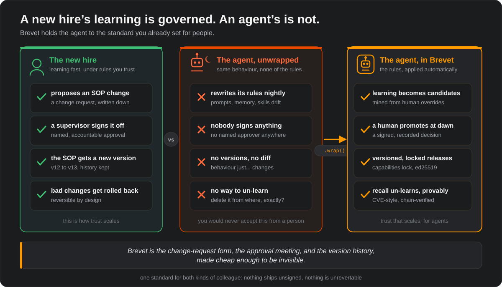
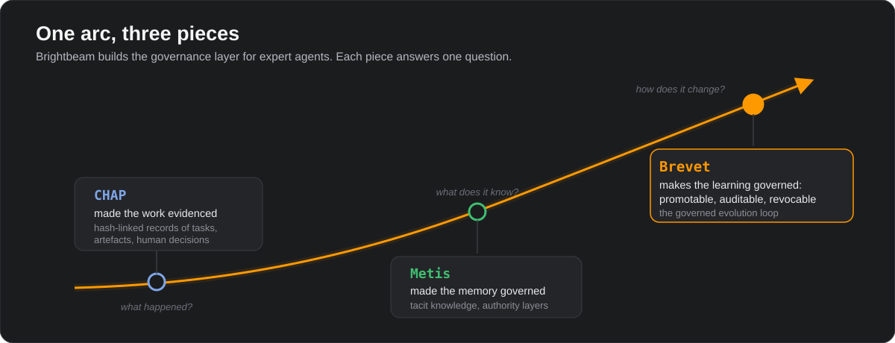

# About Brevet

Everything that is true about the project but does not belong in a
quickstart. For the API, see the [README](README.md). For the normative
rules, see [SPEC.md](SPEC.md). For precise definitions of every term used
here (mission group, delta, dawn gate, endogenous, and the rest), see the
[GLOSSARY](GLOSSARY.md).

## Why Brevet exists

Self-improving agents are shipping: memory systems, skill libraries,
self-edited prompts, harness optimisers. The research literature scores them
on a single axis (did the pass rate go up?). Anyone who *owns* one in
production, especially in a regulated industry, needs answers to three
questions that axis never touches:

1. **What does it know?** Not the weights: the accumulated rules, skills,
   memories, and tool bindings acquired since deployment.
2. **Who approved that?** A learned behaviour changed a real decision.
   Which human said it could ship, and on what evidence?
3. **How do we take it back?** The learned rule was wrong. Where does it
   live, which versions shipped it, and how do you prove it is gone?

Brevet is the runtime that makes those three questions answerable by
construction. It is not an agent framework and it does not compete with
one. It is the envelope around whatever framework you already use.

The standard it applies is one you already trust everywhere people learn on
the job:

<p align="center">
  
</p>

## The arc: CHAP, Metis, Brevet

Brevet is the third piece of the Brightbeam governance arc. Each piece
answers one question about a working agent: what happened, what does it
know, and how does it change.

<p align="center">
  
</p>

| Piece | Question it answers | Mechanism |
|---|---|---|
| [CHAP](https://github.com/BrightbeamAI/chap) | what happened between humans and agents? | hash-linked envelopes for tasks, artefacts, decisions, overrides |
| [Metis](https://github.com/BrightbeamAI/metis) | what does the organisation know tacitly? | governed memory fragments with authority layers |
| **Brevet** | how does the agent change, and under whose authority? | the governed evolution loop |

The three interoperate without translation: Brevet's evidence envelopes are
CHAP-shaped, and its capability object generalises the Metis fragment tuple
(content, provenance, conditions, confidence, authority, validation-state)
with a `kind` field. For `memory_fragment` capabilities, Metis remains the
system of record; Brevet records only the binding.

## What you get

- **Harness as data.** A signed, versioned `agent.yaml` conforming to the
  five-layer Expert Agent Signature: identity/policy, prompt architecture,
  cognitive core, bindings, runtime safety. No invisible pile of prompts.
- **One object for everything learned.** Prompt rules, loop policies,
  skills, tool bindings, eval cases, escalation rules, memory bindings: one
  capability object, one lifecycle (Evidence, Advisory, Controlled), one
  revocation mechanism.
- **The delta engine.** The difference signal `enacted ⊖ specified`: a
  structured comparison of matched episodes, not a subtraction. It mines
  traces and overrides, and it works without a benchmark verifier,
  because human overrides are the labels.
- **Override-compiled evals.** The regression suite is compiled from your
  override history and executed by `agent.evaluate()`. Releases pass the
  conservative gate or they do not ship.
- **capabilities.lock.** The capability bill of materials: what this release
  knows, where each piece came from, who approved it. One file.
- **Recall.** CVE-style un-learning: revoke, flag every release that locked
  it in, roll back, prove it from the chain alone.
- **Local-first model assist.** The dream cycle can draft better wording via
  a local Ollama model (`brevet dream --assist ollama`). Drafts only, always
  logged, never authoritative, fails soft to deterministic templates. The
  entire runtime works with no model installed.
- **CHAP mirroring.** Declare `ledger: chap:<workspace>` and, with the
  official Python coordinator installed
  (`pip install "brevet[chap] @ git+https://github.com/BrightbeamAI/brevet"`),
  every envelope mirrors through a real embedded
  [`chap_coordinator.Coordinator`](https://github.com/BrightbeamAI/chap/tree/main/packages/coordinator-py)
  with a SQLite store in the workdir. Point it at a served coordinator
  instead with `ledger: chap:<workspace>@<url>`, which speaks the same
  CHAP Core JSON-RPC through an offline-tolerant outbox. The local hash
  chain stays the source of truth.

## Supported frameworks

`brevet.wrap()` detects the framework from the wrapped object's class
hierarchy. Execution stays in the framework; Brevet owns the envelope.

| Framework | Wrap | Detected via |
|---|---|---|
| LangGraph | `brevet.wrap(compiled_graph)` | auto |
| Claude Agent SDK | `brevet.wrap(sdk_client)` | auto |
| DeepAgents | `brevet.wrap(deep_agent)` | auto |
| AutoGen (AgentChat) | `brevet.wrap(agent_or_team)` | auto |
| LlamaIndex | `brevet.wrap(agent_or_engine)` | auto |
| Pydantic AI | `brevet.wrap(pydantic_agent)` | auto |
| Google ADK | `brevet.wrap(runner)` | auto |
| CrewAI | `brevet.wrap(crew)` | auto |
| OpenAI Agents SDK | `brevet.wrap(agent)` | auto |
| Anything callable | `brevet.wrap(fn)` | fallback |

A custom framework binds with one adapter class registered through
`brevet.register_adapter` (see the README for the snippet). No framework
is ever a hard dependency: adapters are duck-typed and tested against
fakes.

## What Brevet is not

Not an agent framework. Not autonomous self-improvement: nothing in Brevet
can grant itself authority, and endogenous candidates can never be promoted
by the process that proposed them. Not surveillance: consent scope is
declared in the manifest, and evidence-layer material never influences
behaviour.

## Repository structure

```
brevet/
├── brevet/                  the runtime package
│   ├── adapters.py          framework adapters + registry (10 built in)
│   ├── assist.py            local model assist (Ollama), drafts only
│   ├── canonical.py         canonical JSON, sha256, Ed25519 signing
│   ├── chap_bridge.py       live CHAP mirroring with offline outbox
│   ├── cli.py               the `brevet` command (Typer)
│   ├── delta.py             the delta engine: enacted ⊖ specified
│   ├── demo.py              the end-to-end offline demo
│   ├── evals.py             override-compiled evals + conservative gate
│   ├── evidence.py          override harvesting from draft/final diffs
│   ├── ledger.py            append-only hash-linked evidence ledger
│   ├── lifecycle.py         capability store, dawn gate, release, recall
│   ├── mcp_server.py        the MCP server (optional extra: [mcp])
│   ├── models.py            pydantic models mirroring schemas/
│   ├── runner.py            eval execution + before/after compare
│   └── shell.py             brevet.wrap() and the BrevetAgent object
├── schemas/                 the contract: five JSON Schemas
│   ├── agent_manifest.schema.json
│   ├── capability_object.schema.json
│   ├── capabilities_lock.schema.json
│   ├── release_record.schema.json
│   └── recall_notice.schema.json
├── tests/                   the offline test suite, sub-second
├── docs/
│   ├── demo.html            interactive story tour
│   └── assets/              diagrams + demo GIF
├── README.md · ABOUT.md · GLOSSARY.md · SPEC.md · BENCHMARK.md
├── CONTRIBUTING.md · CHANGELOG.md · LICENSE (Apache-2.0)
└── pyproject.toml
```

## Runtime workdir layout

`brevet.wrap()` persists everything under `.brevet/` (configurable via
`workdir=`):

```
.brevet/
├── agent.yaml               generated manifest (if none was supplied)
├── ledger.jsonl             the evidence chain, one envelope per line
├── capabilities.jsonl       capability store, last write wins per id
├── keys/brevet_ed25519.pem  workspace signing key (gitignored)
└── chap_outbox.jsonl        queued envelopes when a CHAP mirror is offline
```

Never commit `.brevet/`: it contains a private key and operational
evidence. The shipped `.gitignore` already excludes it.

## Evidence envelope kinds

All envelopes are append-only and hash-linked:
`chain_hash = sha256(canonical(envelope) || prev_hash)`.

| Kind | Meaning |
|---|---|
| `brevet.task` | one wrapped agent invocation |
| `brevet.artefact` | an agent output attached to a task |
| `brevet.override` | a human judgment: diff + rationale + tags |
| `brevet.candidate` | a capability proposed by the delta engine |
| `brevet.promotion` | a dawn-gate decision |
| `brevet.release` | a signed harness version transition |
| `brevet.recall` | a capability recall notice |
| `brevet.eval_run` | a regression suite execution |
| `brevet.model_assist` | a logged model-drafting event (drafts only) |

## The capability object

The unit of learned capability, shared with the Metis fragment model:

| Field group | Holds |
|---|---|
| content + content_hash | the payload and its sha256 identity |
| kind | prompt_rule, loop_policy, tool_binding, skill, eval_case, escalation_rule, memory_fragment |
| provenance | mined-by run, source traces/overrides, confirming humans, model-assist refs |
| conditions | applicability context: task family, domain, exclusions, validity window |
| evidence | recurrence, supporting/counter examples, eval results, strength |
| confidence | scalar, bounded by evidence |
| authority_layer | evidence, advisory, controlled |
| validation_state | captured through promoted/held/rejected/withdrawn |

Retrieval is conditions-first: a capability whose conditions do not match
the runtime context is withheld, not down-weighted. Exclusions veto.

## The benchmark: four axes

Self-evolving-agent papers score improvement. Owners need four axes, and
[BENCHMARK.md](BENCHMARK.md) defines a benchmark that scores them all:

1. **Improvement**: held-out pass-rate delta across the lineage.
2. **Regression discipline**: degradations that survived promotion;
   conservative-gate violations.
3. **Lineage completeness**: can a sampled behaviour change be traced
   mechanically to its capability, evidence, eval run, and approver?
4. **Recall compliance**: latency, correctness, and provability of
   un-learning, including one consent-withdrawal event.

Reported as a profile, not a single number. Systems not shaped like a
governed loop cannot pass axes 3 and 4. That is the point.

## Design principles

- **Authority is granted, never grabbed.** Every increase in a capability's
  authority is a recorded human decision.
- **The waking agent is immutable.** Adaptation happens offline; execution
  runs exactly one signed version.
- **Human corrections are the ground truth.** No benchmark oracle exists
  for judgment work; override history is the labelled dataset.
- **Zero required network.** Tests, demo, and the full loop run offline.
  Model assist and CHAP mirroring are optional and fail soft.
- **Rejection is not deletion.** Rejected and recalled capabilities remain
  as governed evidence with lineage intact.
- **Prove it from the chain.** Anything the system claims (promotion,
  release, recall) must be independently replayable from the ledger.
