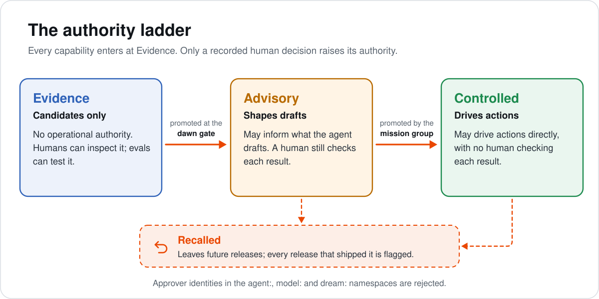
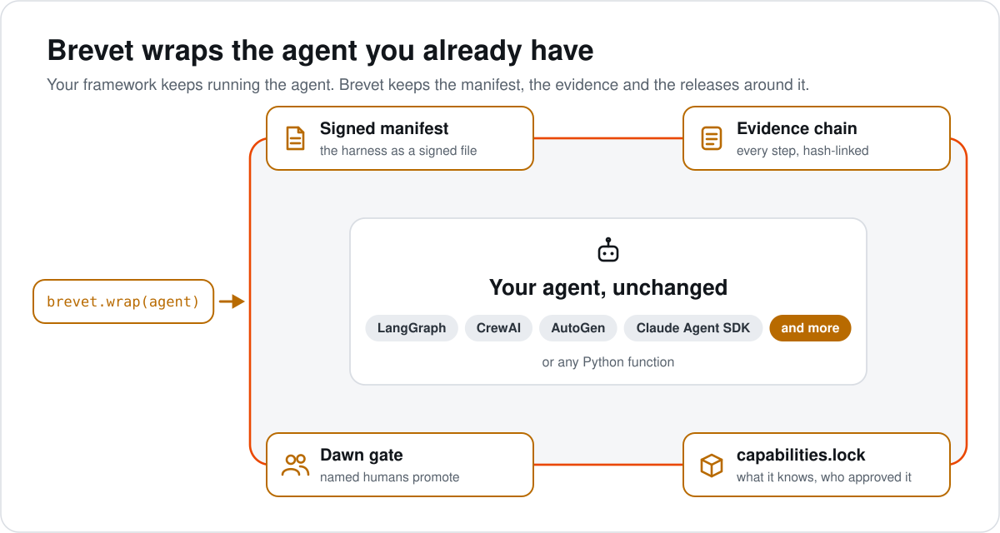
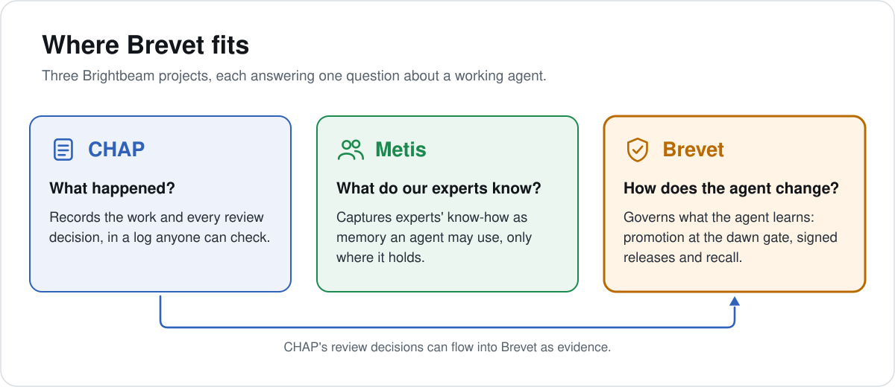

# About Brevet

The detail behind the [README](README.md): how the governed evolution loop
works, how Brevet is built and how the repository is organised. For
definitions of every term, see the [GLOSSARY](GLOSSARY.md). For the rules any
implementation must follow, see [SPEC.md](SPEC.md).

## Why Brevet exists

Organisations already know how to manage change when people learn on the
job. When someone wants to change how a task is done, they write the change
down, a named person approves it, the procedure gets a new version number,
and a bad change can be rolled back. Those steps are how trust in a team
extends beyond the people who know each other personally.

AI agents now learn on the job too. They save memories, add skills and edit
their own instructions, but those changes skip every one of those steps.
That leaves three questions without answers:

1. **What has the agent learned?** Not the model's weights, but the rules,
   skills, memories and tool permissions it has picked up since it was
   deployed.
2. **Who approved it?** A learned behaviour changed a real decision. Which
   accountable person said it could be used, and on what evidence?
3. **How do we take it back?** A learned rule is wrong. Where does it live,
   which versions included it, and what shows it is no longer in use?

Brevet gives an agent's learning the same steps a team's procedures already
have. It is not an agent framework and does not replace one. It wraps the
framework you already use and keeps the records around it.

## The governed evolution loop

The loop has seven stages. Each one appends its envelopes to the evidence
chain.

| Stage | What happens | Who acts | What is recorded |
|---|---|---|---|
| **Work** `run()` | The agent drafts under one signed harness. | the agent | `brevet.task`, `brevet.artefact` |
| **Override** `record_final()` | An expert corrects the draft; the difference and the reason become an override. | an expert | `brevet.override` |
| **Dream** `dream()` | Offline, recurring overrides become candidate capabilities and eval cases, with no authority. | Brevet | `brevet.candidate` |
| **Dawn** `dawn()` | Each candidate is promoted, held, rejected or sent back for re-elicitation. | a named human or mission group | `brevet.promotion` |
| **Evals** `evaluate()` | Overrides replay as tests. The conservative gate needs neither half (held-in or held-out) to get worse and at least one to improve. | Brevet | `brevet.eval_run` |
| **Release** `release()` | Promoted capabilities ship in a signed release with its `capabilities.lock`. | a named human or mission group | `brevet.release` |
| **Recall** `recall()` | A capability is withdrawn, and every release that shipped it is flagged. | a named human or mission group | `brevet.recall` |

The names follow the loop's day-and-night rhythm, which the paper calls the
circadian contract. Awake, the agent works under one signed version and does
not change itself. While it sleeps, the dream cycle mines what the day's
overrides imply. At dawn, people review what the night proposed, and only what
they promote reaches the agent, through a signed release.

Overrides come in two kinds. A **refining** override keeps the agent's decision
and changes its wording. A **substituting** override reaches a different
decision, as when *minor* becomes *major*. The dream cycle treats them as soft
and hard signals.

The dream cycle adds only what is new, so it can run every night. A group of
overrides that already produced a candidate is not proposed again, whatever
happened to that candidate since. When more overrides join the group, the new
candidate supersedes the pending one, and a candidate whose content matches a
recalled capability is never proposed.

## The authority ladder

<p align="center">
  <picture>
    <source media="(prefers-color-scheme: dark)" srcset="docs/assets/levels-dark.svg">
    
  </picture>
</p>

Every capability holds one authority layer. It enters at **Evidence**, with no
operational authority. Promotion at the dawn gate raises it to **Advisory**,
where it may inform what the agent drafts while a human still checks each
result. **Controlled**, where it may drive actions directly, needs promotion
by a mission group. Only `human:` and `mission_group:` identities can decide;
every other namespace, including `agent:`, `model:` and `dream:`, is refused.
Rejection is not deletion: rejected candidates stay on the evidence chain, so
"was this ever proposed, and why did we say no?" always has an answer.

## The worked example

[examples/pump_vibration.py](examples/pump_vibration.py) runs the README's
example from the first override to the recall. Running it prints:

```text
1. Work and override: 4 overrides recorded from 5 drafts (1 draft accepted as it was).
2. Dream: 1 candidate capability, Evidence layer (no authority yet):
   In equipment_triage work involving 'vibration-during-cleaning', reviewers changed
   the agent's decision 4 times. Their reason: Vibration during cleaning is an early
   sign of seal wear. Proposed rule: when this situation applies, raise it explicitly
   and follow the reviewers' decision.
3. Dawn: rejected an approval from dream:nightly (machine identities cannot promote).
   Dawn: promoted to Advisory by mission_group:quality_team.
4. Evals: 0/4 passed before, 4/4 after. Conservative gate: pass.
5. Release: 0.2.0 signed; capabilities.lock lists 1 promoted capability and its approver.
6. Recall: capability recalled; releases flagged: 0.2.0.
7. Verify: evidence chain intact.
   Records are in <temporary folder>
```

## What is in the box

- **The harness as data.** `agent.yaml`, the manifest, holds the agent's
  instructions, tools, loop policy, memory bindings and safety settings in
  five layers. It is versioned and signed at every release.
- **One capability object for everything learned.** Prompt rules, skills,
  tool bindings, eval cases, escalation rules and memory bindings share one
  structure, one authority ladder and one recall mechanism.
- **Override-compiled evals.** `agent.evaluate()` replays the overrides as
  tests, so no separate labelling project is needed. Cases are sorted by
  content hash and dealt alternately into the held-in and held-out halves.
- **A capability bill of materials for every release.** `capabilities.lock`
  lists what the release knows, where each capability came from, the hash of
  its exact content and who approved it. The release signature covers the
  lock's digest.
- **Optional model assist.** `brevet dream --assist ollama` lets a local
  model word candidates more clearly. Its output is always a draft, every use
  is logged, and Brevet works fully without it.
- **CHAP mirroring.** Set `ledger: chap:<workspace>` in `agent.yaml`, install
  the extra with `pip install "brevet[chap]"`, and every evidence envelope is
  also mirrored to a CHAP coordinator running alongside, with its own database
  in the working directory. To use a coordinator on another machine, write
  `ledger: chap:<workspace>@<url>`; envelopes queue in an outbox while the
  connection is down. The local evidence chain remains the record of
  reference.

## Supported frameworks

<p align="center">
  <picture>
    <source media="(prefers-color-scheme: dark)" srcset="docs/assets/wrap-dark.svg">
    
  </picture>
</p>

`brevet.wrap()` works out which framework built the agent from the agent
object itself. The framework keeps running the agent; Brevet keeps the
records.

| Framework | How to wrap it |
|---|---|
| LangGraph | `brevet.wrap(compiled_graph)` |
| Claude Agent SDK | `brevet.wrap(sdk_client)` |
| DeepAgents | `brevet.wrap(deep_agent)` |
| AutoGen (AgentChat) | `brevet.wrap(agent_or_team)` |
| LlamaIndex | `brevet.wrap(agent_or_engine)` |
| Pydantic AI | `brevet.wrap(pydantic_agent)` |
| Google Agent Development Kit | `brevet.wrap(runner)` |
| CrewAI | `brevet.wrap(crew)` |
| OpenAI Agents SDK | `brevet.wrap(agent)` |
| any Python function | `brevet.wrap(fn)` |

Another framework needs one adapter class, registered with
`brevet.register_adapter`:

```python
@brevet.register_adapter("myfw", prefixes=("myfw",))
class MyAdapter(brevet.BaseAdapter):
    def invoke(self, task, context):
        return self.target.do(task), [{"step": "do"}]
```

No framework is ever a required dependency: adapters check the shape of the
object they are given, and the tests use stand-ins rather than the real
frameworks. Outside the shadow channel, a wrapped agent runs only while its
manifest signature verifies, so an edit made after a release stops the agent
instead of running unrecorded.

## The MCP server

`brevet mcp` serves the loop to any MCP client, such as Claude Desktop, Claude
Code or Cursor. Clients may start servers from any directory, so point
`BREVET_HOME` at a folder that holds `agent.yaml` and `.brevet/`:

```json
{"mcpServers": {"brevet": {
  "command": "uvx", "args": ["brevet", "mcp"],
  "env": {"BREVET_HOME": "/path/to/workspace"}}}}
```

| Tool | What it does |
|---|---|
| `brevet_record` | records a draft and the expert's final; a difference becomes an override |
| `brevet_chap_ingest` | imports CHAP review verdicts as overrides |
| `brevet_dream` | runs the dream cycle |
| `brevet_dawn_pending` | lists the candidates awaiting a dawn decision |
| `brevet_dawn_decide` | records one dawn decision under a human or mission-group identity |
| `brevet_release` | signs and records a release, with the conservative gate for trial and production |
| `brevet_recall` | recalls a capability and flags the releases that shipped it |
| `brevet_active` | serves the governed rules of the latest release, after checking the chain, the lock, the signature and each rule's content |
| `brevet_status` | reports the version, capabilities by layer, the dawn queue and chain health |
| `brevet_verify` | replays the evidence chain |

Read-only tools carry the MCP read-only hint, and the dawn, release and recall
tools carry the destructive hint, so clients can ask before running them.
Sessions record corrections only when asked, unless the workspace owner turns
on automatic capture with `BREVET_AUTO_CAPTURE=1` or
`runtime_safety.evidence.auto_capture: true` in the manifest.

## Commands

| Command | What it does |
|---|---|
| `brevet demo` | runs the whole loop once on synthetic data, offline |
| `brevet playground` | steps through the loop in a browser |
| `brevet init` | writes a starter `agent.yaml` and `.brevet/` |
| `brevet dream` | mines recurring overrides into candidates |
| `brevet dawn` | lists the dawn queue, or records one decision with `--decide` |
| `brevet release` | passes the conservative gate, then signs and records a release |
| `brevet recall` | recalls a capability and flags every release that shipped it |
| `brevet verify` | replays the evidence chain |
| `brevet status` | shows the version, capabilities by layer and chain health |
| `brevet chap-ingest` | imports CHAP review verdicts as overrides |
| `brevet mcp` | serves the loop to an MCP client |

## Governing what Claude itself learns

Claude Desktop and Cowork already learn between sessions through memory, saved
skills and standing instructions. [examples/claude-cowork](examples/claude-cowork)
puts that learning under the governed evolution loop in a few minutes. Your
corrections become overrides, you promote candidates at dawn, and the governed
rules Claude receives come only from a signed release. In Claude these
controls detect rather than prevent: Claude's own memory and skills keep
working outside Brevet, so the example makes them visible and reviewable
rather than impossible.

## Where Brevet fits

<p align="center">
  <picture>
    <source media="(prefers-color-scheme: dark)" srcset="docs/assets/suite-dark.svg">
    
  </picture>
</p>

| Project | Question it answers | What it owns |
|---|---|---|
| [CHAP](https://github.com/BrightbeamAI/chap) | What happened between people and agents? | the record of tasks, drafts, reviews and decisions |
| [Metis](https://github.com/BrightbeamAI/metis) | What do our experts know that is not written down? | experts' know-how, captured as governed memory |
| **Brevet** | How does the agent change, and on whose approval? | approvals, capability state and recalls |

The three are designed to work together, and each owns its own records.
Brevet's evidence envelopes follow CHAP's envelope model, so Brevet writes
CHAP-compatible evidence and can mirror it to a live CHAP coordinator;
`brevet chap-ingest` imports CHAP review decisions as overrides. Brevet's
capability object extends the tuple Metis uses for tacit fragments, adding a
`kind` field. For `memory_fragment` capabilities, Metis stays the system of
record; Brevet records only the binding and its approval.

## What Brevet is not

Brevet is not an agent framework. It does not let an agent improve itself
without oversight: candidates have no authority until a human or mission
group promotes them, and approvals under machine identities are refused. It
is not a monitoring tool either. The manifest declares whose overrides the
dream cycle may learn from (its consent scope), and Evidence-layer material
never influences the agent; the dream cycle does not yet filter overrides by
that declaration, so a deployment applies it at capture.

## Project status

Brevet implements the whole loop and keeps every record. Some protections
are left to the system you deploy it in, and the [paper](README.md#citation)
sets them out in full:

- **Authenticated approvers.** Brevet records the identity given for every
  decision and refuses anything other than `human:` and `mission_group:`
  identities. Proving that the named human really decided needs
  authenticated identities, which CHAP's participant keys can supply.
- **Recall that reaches running agents.** A recalled capability, and any
  capability with identical content, is left out of every later release, and
  the releases that shipped it are flagged. Confirming that running agents
  have stopped using it needs checks where the agent runs.
- **An anchored evidence chain.** Replay detects edits that break the chain.
  Detecting a wholesale rewrite, or a chain cut short at the end, needs the
  latest chain hash held outside the machine, which a CHAP coordinator can
  hold.
- **Measured eval deltas.** The conservative gate checks the deltas passed to
  `release()`. `agent.evaluate()` measures them, but nothing yet ties a release
  to the eval runs that produced its numbers.

## How the repository is organised

```
brevet/
├── brevet/                   the Python package
│   ├── shell.py              brevet.wrap() and the agent object it returns
│   ├── adapters.py           framework adapters and the adapter registry
│   ├── evidence.py           harvests overrides from drafts and finals
│   ├── delta.py              the dream cycle: mines overrides into candidates
│   ├── lifecycle.py          the dawn gate, releases and recall
│   ├── evals.py              override-compiled evals; the conservative gate
│   ├── runner.py             runs the evals before and after a change
│   ├── ledger.py             the hash-linked evidence chain
│   ├── canonical.py          content hashing and Ed25519 signing
│   ├── workdir.py            workspace location, permissions and file locks
│   ├── models.py             data models matching the schemas
│   ├── assist.py             optional local model assist
│   ├── chap_bridge.py        mirrors envelopes to a CHAP coordinator
│   ├── chap_evidence.py      imports CHAP review decisions as overrides
│   ├── mcp_server.py         the loop as MCP tools
│   ├── playground.py         the loop, stage by stage, in a browser
│   ├── demo.py               the end-to-end demonstration
│   └── cli.py                the `brevet` command
├── schemas/                  the five JSON Schemas that define the records
├── examples/
│   ├── pump_vibration.py     the worked example from the README
│   └── claude-cowork/        governing what Claude itself learns
├── docs/
│   ├── demo.html             the interactive tour
│   └── assets/               the diagrams, in light and dark versions
├── scripts/
│   ├── make_diagrams.py      regenerates the diagrams
│   └── make_pypi_readme.py   writes README_PYPI.md for PyPI
├── tests/                    the test suite; runs offline
├── server.json               the MCP Registry entry
└── README.md · ABOUT.md · GLOSSARY.md · SPEC.md · BENCHMARK.md
```

## What Brevet stores, and where

`brevet.wrap()` keeps everything in a working directory, `.brevet/` by default
(change it with `workdir=`). Brevet creates it readable only by you, with a
`.gitignore` that keeps it out of version control:

```
.brevet/
├── agent.yaml                the manifest, if none was supplied
├── capabilities.lock         the latest release's lock, beside the manifest
├── ledger.jsonl              the evidence chain: one envelope per line
├── capabilities.jsonl        the capability store; latest line per id wins
├── keys/brevet_ed25519.pem   the signing key, created at the first release
├── chap_cursor.json          how far each CHAP source has been imported
├── chap.db                   an embedded CHAP coordinator's store, if used
├── chap_outbox.jsonl         envelopes waiting to be mirrored to CHAP
└── *.lock                    short-lived locks that let processes share files
```

When a manifest path is given, `agent.yaml` and `capabilities.lock` live
beside it instead. Never commit `.brevet/`: it holds a private key and the
evidence of real work.

## Evidence envelopes

Every envelope is appended, never edited, and hash-linked to the one before
it: `chain_hash = sha256(encode(envelope) ‖ prev_hash)`. Appends take a file
lock, so several processes can share one chain.

| Envelope | Appended when |
|---|---|
| `brevet.task` | the agent is given a task |
| `brevet.artefact` | the agent produces a draft |
| `brevet.override` | an expert's correction is recorded |
| `brevet.candidate` | the dream cycle proposes a candidate |
| `brevet.model_assist` | a local model helps word a candidate |
| `brevet.promotion` | a decision is made at the dawn gate |
| `brevet.eval_run` | the evals run |
| `brevet.release` | a new version is released |
| `brevet.recall` | a capability is recalled |

## The benchmark

Research on self-improving agents mostly measures one thing: whether the
agent got better. Teams running agents in production need four measures,
and [BENCHMARK.md](BENCHMARK.md) proposes a governed-adaptation benchmark
that reports all four side by side: improvement, regression discipline,
lineage completeness and recall compliance. No implementation of the
benchmark exists yet.

## Design principles

- **Authority is granted, never grabbed.** Every increase in a
  capability's authority is a recorded decision by a named human or mission
  group.
- **The running agent does not change itself.** It runs one released
  version. Learning happens between versions, where it can be reviewed.
- **Overrides are evidence, not truth.** Experts' corrections are the best
  available record of judgement, but they can be mistaken, so candidates are
  reviewed at dawn before they gain authority.
- **No network needed.** The tests, the demonstration and the whole loop run
  offline. Model assist and CHAP mirroring are optional and fail safely.
- **Rejection is not deletion.** Rejected and recalled capabilities stay on
  the evidence chain with their lineage intact.
- **Prove it from the chain.** Promotions, releases and recalls are all
  envelopes on the evidence chain, so anyone holding it can replay and check
  them.
