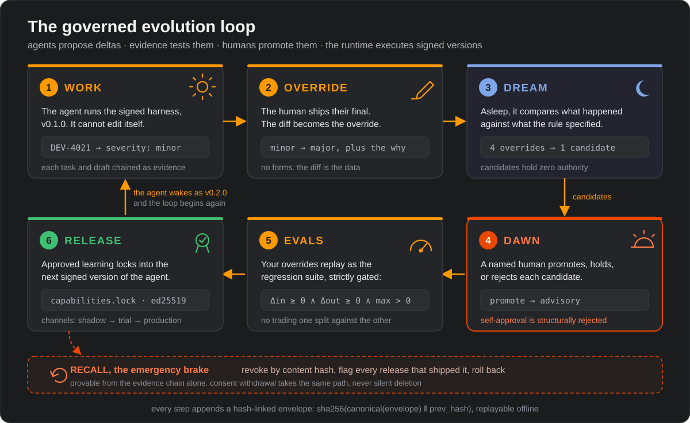
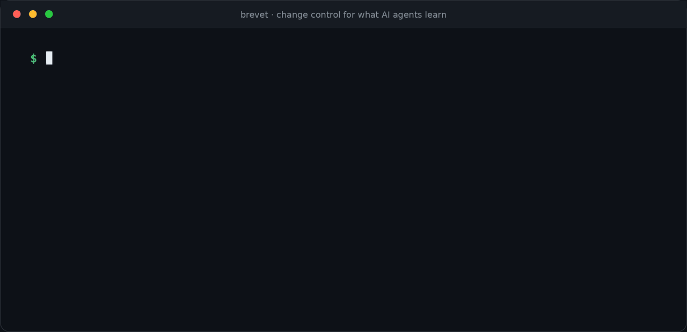
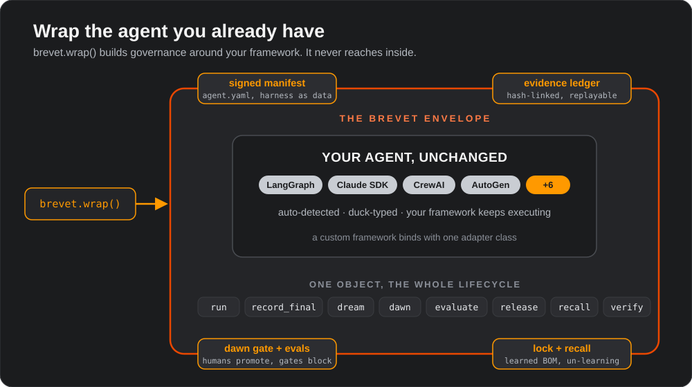
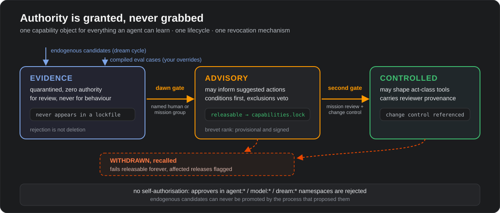

# Brevet

**Change control for what AI agents learn.**

[](https://www.python.org/downloads/)
[](LICENSE)

Agents can now improve themselves. What no organisation can answer about a
learning agent is: *what does it know, who approved it, and how do we take it
back when it is wrong?* Brevet answers all three, and binds to whatever you
already build on. One doctrine:

> Agents propose deltas; evidence tests them; humans promote them;
> the runtime only ever executes signed versions.

## The governed evolution loop

Brevet runs your agent's learning as a supervised cycle. While the agent
works, it executes one signed, immutable harness; it cannot change itself
mid-flight. Improvement happens around it, in six steps, each recorded as
tamper-evident evidence.

The step names follow the loop's day-and-night rhythm. Awake, the agent
works and cannot change itself. While it sleeps, Brevet mines what the
day's corrections imply: the **dream**. At **dawn**, a human reviews what
the night proposed, and only what they approve ever reaches the agent.

<p align="center">
  
</p>

1. **Work.** Your agent drafts; the human ships their final. Brevet chains
   every task and draft as evidence.
2. **Override.** Brevet harvests the draft/final diff as an override,
   records the rationale, and classifies the change: refining kept the
   decision, substituting reversed it. Nobody fills in a form.
3. **Dream.** Offline, Brevet computes the delta, enacted ⊖ specified:
   a structured comparison of what actually happened against what the
   harness specified. Divergences that recur become candidate
   capabilities. Candidates carry zero authority.
4. **Dawn.** A named human or mission group (the accountable review
   board for the work: a panel, never a single expert) promotes, holds,
   or rejects each candidate. Brevet rejects approvers in the `agent:*`,
   `model:*`, and `dream:*` namespaces: nothing can promote its own
   learning.
5. **Evals.** Brevet replays your override history as the regression
   suite. The conservative gate (`din >= 0 AND dout >= 0 AND max > 0`)
   blocks any release that trades one split against the other.
6. **Release.** Brevet locks the approved capabilities into
   `capabilities.lock` and signs the manifest (Ed25519). The agent wakes
   as the next version, and the loop begins again.

And when a promoted capability is later proved wrong: **recall**. Revoke it
by content hash, flag every release that shipped it, roll back, and prove
all of it from the evidence chain alone.

Every term above (harness, delta, dream, dawn, mission group, authority
layer, and the rest) is defined precisely in the [GLOSSARY](GLOSSARY.md).

## Quickstart

```console
$ pip install "brevet @ git+https://github.com/BrightbeamAI/brevet"
```

Python 3.10+. Four dependencies (pydantic, typer, PyYAML, cryptography).
No model, no network, no GPU required.

```python
import brevet

agent = brevet.wrap(my_agent)                 # any framework, zero config
r = agent.run("triage deviation DEV-4021", task_family="deviation_triage")
agent.record_final(r.task_id, edited_text, participant="human:qa@site",
                   rationale="Vibration on CIP duty is a seal-wear precursor.")
```

That is the whole integration. `wrap()` auto-detects the framework,
generates a signed-manifest scaffold (`agent.yaml`), and starts the evidence
chain. The rest of the loop lives on the same object:

```python
agent.dream()      # offline: mine enacted ⊖ specified into candidates
agent.dawn()       # pending queue -> [CapabilityObject, ...]
agent.dawn(decide=(cap_id, "promote"), approver="human:qa@site")
before = agent.evaluate()                     # override-compiled regression suite
# ... apply the promoted change ...
after = agent.evaluate()
agent.release(to_version="0.2.0", channel="trial", approver="mission_group:rft",
              delta_in=0.2, delta_out=0.1)    # signed; conservative gate enforced
agent.recall(cap_id, reason="proved wrong", issued_by="mission_group:rft")
agent.verify()     # independent replay of the hash-linked evidence chain
agent.status()
```

### See it run

<p align="center">
  
</p>

```console
$ git clone https://github.com/BrightbeamAI/brevet && cd brevet
$ pip install -e ".[dev]" && brevet demo
```

Exact held-in/held-out figures vary per run (the split is hash-assigned);
the gate passes either way.

## Supported frameworks

`brevet.wrap()` auto-detects LangGraph, Claude Agent SDK, DeepAgents,
AutoGen, LlamaIndex, Pydantic AI, Google ADK, CrewAI, the OpenAI Agents
SDK, and anything callable. The full detection table is in
[ABOUT.md](ABOUT.md#supported-frameworks).

Your framework missing? One class:

```python
@brevet.register_adapter("myfw", prefixes=("myfw",))
class MyAdapter(brevet.BaseAdapter):
    def invoke(self, task, context):
        return self.target.do(task), [{"step": "do"}]
```

Brevet never modifies the wrapped object. Execution stays in your framework;
Brevet owns the envelope: manifest, evidence, promotion, release, recall.

<p align="center">
  
</p>

## MCP server

Serve the full lifecycle to any MCP client (Claude Code, Claude Desktop,
Cursor, your own agents):

```console
$ pip install "brevet[mcp] @ git+https://github.com/BrightbeamAI/brevet"
$ brevet mcp
```

```json
{"mcpServers": {"brevet": {"command": "brevet", "args": ["mcp"]}}}
```

Tools: `brevet_status`, `brevet_dream`, `brevet_dawn_pending`,
`brevet_dawn_decide`, `brevet_release`, `brevet_recall`, `brevet_verify`.
Authority invariants hold over MCP exactly as in code: an agent calling
these tools still cannot promote its own capabilities.

## The authority model

Every learned thing (prompt rule, loop policy, skill, tool binding, eval
case, escalation rule, memory binding) is the same capability object with
one lifecycle and one revocation mechanism. Capabilities climb a ladder,
and every climb is a recorded human decision:

<p align="center">
  
</p>

Evidence-layer material can never appear in a lockfile; endogenous
candidates can never be promoted by the process that proposed them;
rejection is not deletion.

## CLI

| Command | What it does |
|---|---|
| `brevet init` | scaffold `agent.yaml` and the `.brevet/` workdir |
| `brevet demo` | run the whole loop on synthetic data, offline |
| `brevet dream` | mine the ledger into candidate capabilities |
| `brevet dawn` | list pending candidates, or apply one decision |
| `brevet release` | gate-check, sign, and release the next version |
| `brevet recall` | revoke a capability and flag affected releases |
| `brevet verify` | independently replay the evidence chain |
| `brevet status` | version, channel, capability counts, chain health |
| `brevet mcp` | serve the lifecycle over MCP (stdio) |

## Documentation

| Where | What |
|---|---|
| [ABOUT.md](ABOUT.md) | the story, repo structure, envelope kinds, design principles |
| [GLOSSARY.md](GLOSSARY.md) | every term defined: mission group, delta, dawn gate, endogenous, ... |
| [SPEC.md](SPEC.md) | the normative rules a conforming implementation must enforce |
| [BENCHMARK.md](BENCHMARK.md) | the governed-adaptation benchmark design |
| [docs/demo.html](docs/demo.html) | interactive story tour (open locally or via GitHub Pages) |
| [schemas/](schemas/) | the five JSON Schemas that are the contract |
| [CONTRIBUTING.md](CONTRIBUTING.md) | dev setup, ground rules, what lands well |
| [CHANGELOG.md](CHANGELOG.md) | release history |

## Status

v0.1.0: the full loop, ten framework adapters, MCP server, eval runner,
local model assist, CHAP mirroring. 31 tests, all green, no network
required. Contributions welcome, framework adapters especially.

Apache-2.0 · built on [CHAP](https://github.com/BrightbeamAI/chap) ·
interoperates with [Metis](https://github.com/BrightbeamAI/metis)
