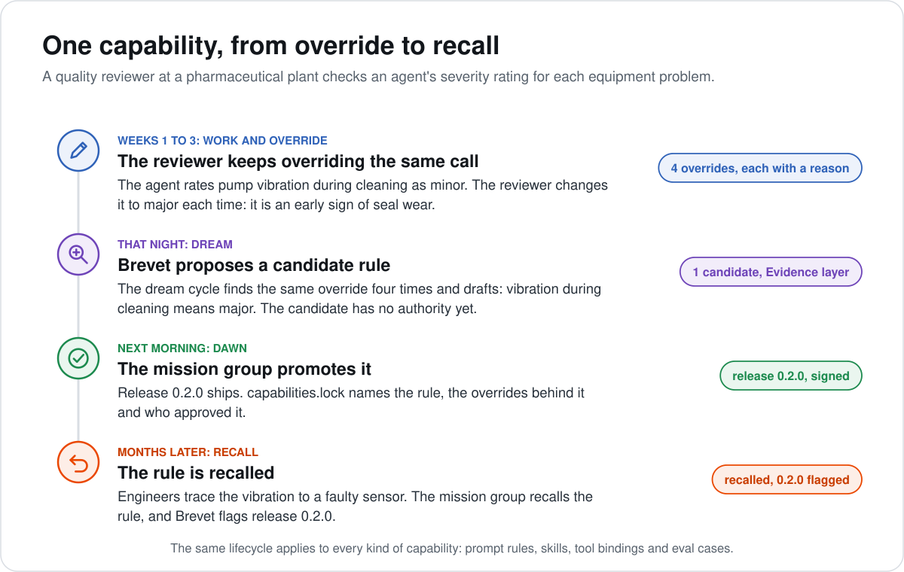

<p align="center">
  <a href="https://github.com/BrightbeamAI">
    <picture>
      <source media="(prefers-color-scheme: dark)" srcset="docs/assets/brightbeam-logo-dark.svg">
      
    </picture>
  </a>
</p>

<h1 align="center">Brevet: Change Control for What AI Agents Learn</h1>

<p align="center"><b>A governed evolution loop that makes agent learning promotable,
auditable, and revocable.</b></p>

<p align="center">
  <a href="https://www.python.org/downloads/"></a>
  <a href="LICENSE"></a>
  <a href="https://github.com/BrightbeamAI/brevet/actions/workflows/ci.yml"></a>
  <a href="https://github.com/BrightbeamAI/chap"></a>
</p>

---

AI agents now change their own behaviour while they work. They save memories,
write themselves new skills and edit their own instructions. Many of these
changes help. Yet none of them passes through the steps an organisation expects
when a person changes how work is done. Nobody writes the change down, nobody
approves it, and when it turns out to be wrong there is no earlier version to
go back to.

Brevet adds those steps. It is a Python runtime that wraps the agent you
already have and runs its learning as a **governed evolution loop**. When an
expert corrects the agent's draft, Brevet records the correction and its reason
as an **override**. Offline, in the **dream** cycle, overrides that keep
recurring become **candidate** capabilities, which have no authority. At the
**dawn** gate, a named human or **mission group** (the accountable review board)
decides which candidates to promote. Promoted capabilities ship in a signed
**release**, listed in `capabilities.lock`, and a capability that proves wrong
can be **recalled**, with every release that shipped it flagged.

> Agents propose deltas; evidence tests them; humans promote them;
> the runtime only ever executes signed versions.

<p align="center">
  <picture>
    <source media="(prefers-color-scheme: dark)" srcset="docs/assets/how-it-works-dark.svg">
    
  </picture>
</p>

## Three questions Brevet answers

| Question | How Brevet answers it |
|---|---|
| **What has the agent learned?** | Every release carries `capabilities.lock`, the capability bill of materials: each learned capability, where it came from and the hash of its exact content. |
| **Who approved it?** | Each capability records the human or mission group that promoted it at the dawn gate, with the overrides that justified it. |
| **How do we take it back?** | Recall it. Brevet flags every release that shipped it and records why it was recalled. |

## What makes Brevet different

- **One capability object for everything an agent learns.** A prompt rule, a
  skill, a tool binding or an eval case is stored the same way, moves through
  the same lifecycle and is recalled the same way.
- **Candidates have no authority until a human promotes them.** The dream cycle
  can propose, but it cannot enact, and Brevet rejects any approval made under
  an `agent:`, `model:` or `dream:` identity.
- **Overrides supply the evidence.** The corrections experts already make become
  both the candidates and the evals that test them, so there is no separate
  labelling project.
- **Releases work like software releases.** Each one is signed and carries its
  capability bill of materials.
- **Every step lands on a hash-linked evidence chain.** Each envelope is linked
  to the one before it, so an edit to the history shows up on replay.
- **It wraps the agent you have.** Your framework keeps running the agent;
  Brevet keeps the manifest, the evidence and the releases around it.

## A concrete example

A quality reviewer at a pharmaceutical plant checks an agent's severity rating
for each equipment problem. The agent rates pump vibration during cleaning as
*minor*. She overrides it to *major* every time, because that vibration is an
early sign of seal wear. After four overrides, the dream cycle proposes a
candidate rule. At dawn her mission group promotes it, and release 0.2.0 ships
with the rule in its `capabilities.lock`. Months later, engineers trace the
vibration to a faulty sensor, so the mission group recalls the rule and Brevet
flags release 0.2.0.

<p align="center">
  <picture>
    <source media="(prefers-color-scheme: dark)" srcset="docs/assets/example-dark.svg">
    
  </picture>
</p>

The same story in code. The agent here is a plain Python function; with a real
framework you pass your agent object instead.

```python
import brevet
from brevet.runner import EvalRunner

agent = brevet.wrap(triage_agent)          # wrap the agent you already have

# Work and override: the agent drafts; the reviewer corrects the draft and says why.
result = agent.run("Pump P-301: vibration high during cleaning",
                   task_family="equipment_triage")
agent.record_final(result.task_id, "severity: major",
                   participant="human:qa.reviewer@example.com",
                   rationale="Vibration during cleaning is an early sign of seal wear.",
                   tags=["vibration-during-cleaning"])

# Dream: once the same override keeps recurring, it becomes a candidate.
agent.dream()
candidates = agent.dawn()                   # the dawn queue
rule = next(c for c in candidates if c.kind == "prompt_rule")

# Dawn: a named mission group promotes it. A dream:* approver is rejected.
agent.dawn(decide=(rule.capability_id, "promote"),
           approver="mission_group:quality_team")

# Evals: replay the overrides as tests, before and after the change.
before = agent.evaluate()
#    ...update your agent so that it follows the promoted rule...
after = agent.evaluate()

# Release: refused unless the conservative gate passes.
check = EvalRunner.compare(before, after)
agent.release(to_version="0.2.0", channel="trial",
              approver="mission_group:quality_team",
              delta_in=check["delta_held_in"], delta_out=check["delta_held_out"])

# Recall: the rule proves wrong. Then verify the whole evidence chain.
agent.recall(rule.capability_id, reason="The vibration came from a faulty sensor.",
             issued_by="mission_group:quality_team")
agent.verify()
```

The full script is [examples/pump_vibration.py](examples/pump_vibration.py).
Running it prints:

```text
1. Work and override: 4 overrides recorded from 5 drafts (1 draft accepted as it was).
2. Dream: 1 candidate capability, Evidence layer (no authority yet):
   In equipment_triage work involving 'vibration-during-cleaning', reviewers changed
   the agent's decision 4 times. Their reason: Vibration during cleaning is an early
   sign of seal wear. Proposed rule: when this situation applies, raise it explicitly
   and follow the reviewers' decision.
3. Dawn: rejected an approval from dream:nightly (machine identities cannot promote).
   Dawn: promoted to Advisory by mission_group:quality_team.
4. Evals: 0/4 passed before, 4/4 after. Conservative gate: pass.
5. Release: 0.2.0 signed; capabilities.lock lists 1 promoted capability and its approver.
6. Recall: capability recalled; releases flagged: 0.2.0.
7. Verify: evidence chain intact.
```

## Quickstart

```console
git clone https://github.com/BrightbeamAI/brevet && cd brevet
pip install -e .
python examples/pump_vibration.py      # the example above
brevet demo                            # the whole loop as one command
brevet playground                      # step through the loop in your browser
```

Everything runs on your own machine, and the examples need no model or network
connection. For a guided, clickable tour, open [docs/demo.html](docs/demo.html)
in a browser.

## The seven stages

| Stage | What happens | Who acts | What is recorded |
|---|---|---|---|
| **Work** `run()` | The agent drafts under one signed harness. | the agent | `brevet.task`, `brevet.artefact` |
| **Override** `record_final()` | An expert corrects the draft; the difference and the reason become an override. | an expert | `brevet.override` |
| **Dream** `dream()` | Offline, recurring overrides become candidate capabilities and eval cases, with no authority. | Brevet | `brevet.candidate` |
| **Dawn** `dawn()` | Each candidate is promoted, held, rejected or sent back for re-elicitation. | a named human or mission group | `brevet.promotion` |
| **Evals** `evaluate()` | Overrides replay as tests. The conservative gate needs neither split to get worse and at least one to improve. | Brevet | `brevet.eval_run` |
| **Release** `release()` | Promoted capabilities ship in a signed release with its `capabilities.lock`. | a named human or mission group | `brevet.release` |
| **Recall** `recall()` | A capability is withdrawn, and every release that shipped it is flagged. | a named human or mission group | `brevet.recall` |

The names follow the loop's day-and-night rhythm, which the paper calls the
circadian contract. Awake, the agent works under one signed version and does
not change itself. While it sleeps, the dream cycle mines what the day's
overrides imply. At dawn, people review what the night proposed, and only what
they promote reaches the agent, through a signed release.

Overrides come in two kinds. A **refining** override keeps the agent's decision
and changes its wording. A **substituting** override reaches a different
decision, as when *minor* becomes *major*. The dream cycle treats them as soft
and hard signals.

### The authority ladder

<p align="center">
  <picture>
    <source media="(prefers-color-scheme: dark)" srcset="docs/assets/levels-dark.svg">
    
  </picture>
</p>

Every capability holds one authority layer. It enters at **Evidence**, with no
operational authority. Promotion at the dawn gate raises it to **Advisory**,
where it may inform what the agent drafts while a human still checks each
result. **Controlled**, where it may drive actions directly, needs review by
the mission group. Rejection is not deletion: rejected candidates stay on the
evidence chain, so "was this ever proposed, and why did we say no?" always has
an answer.

## Works with the agent you already have

<p align="center">
  <picture>
    <source media="(prefers-color-scheme: dark)" srcset="docs/assets/wrap-dark.svg">
    
  </picture>
</p>

`brevet.wrap()` recognises agents built with LangGraph, the Claude Agent SDK,
DeepAgents, AutoGen, LlamaIndex, Pydantic AI, the Google Agent Development Kit,
CrewAI and the OpenAI Agents SDK, and it accepts any Python function. Brevet
never changes the agent it wraps. Another framework needs one small adapter:

```python
@brevet.register_adapter("myfw", prefixes=("myfw",))
class MyAdapter(brevet.BaseAdapter):
    def invoke(self, task, context):
        return self.target.do(task), [{"step": "do"}]
```

The whole loop is also available to any MCP client, such as Claude Desktop or
Cursor, through `brevet mcp`.

## Govern what Claude itself learns

Claude Desktop and Cowork already learn between sessions through memory, saved
skills and standing instructions. [examples/claude-cowork](examples/claude-cowork)
puts that learning under the governed evolution loop in a few minutes. Your
corrections become overrides, you promote candidates at dawn, and Claude follows
only capabilities from a signed release.

## Where Brevet fits

<p align="center">
  <picture>
    <source media="(prefers-color-scheme: dark)" srcset="docs/assets/suite-dark.svg">
    
  </picture>
</p>

Each project owns its own records. [CHAP](https://github.com/BrightbeamAI/chap)
keeps the record of the work and the reviews.
[Metis](https://github.com/BrightbeamAI/metis) captures experts' tacit
knowledge as governed memory. Brevet owns the approvals, the state of each
capability and the recalls. Brevet writes CHAP-compatible evidence, can mirror
it to a live CHAP coordinator, and can import CHAP review decisions as overrides
with `brevet chap-ingest`.

## Project status

Version 0.1 implements the whole loop and keeps every record. Three protections
are left to the system you deploy it in, and the [paper](#citation) sets them
out in full:

- **Authenticated approvers.** Version 0.1 records the approver identity and
  rejects machine namespaces. Proving that the named human really decided needs
  authenticated identities, which CHAP's participant keys can supply.
- **Complete recall.** Version 0.1 excludes the recalled capability from future
  releases and flags the affected ones. Blocking identical content from
  returning under a new identifier, and confirming that running agents have
  stopped using it, need checks where the agent runs.
- **An anchored evidence chain.** Replay detects edits that break the chain.
  Detecting a wholesale rewrite needs the latest chain hash held outside the
  machine, which a CHAP coordinator can hold.

## Learn more

- **[Interactive tour](docs/demo.html)**: the quickest way to see the whole
  loop.
- **[GLOSSARY.md](GLOSSARY.md)**: every term, with its plain meaning first.
- **[ABOUT.md](ABOUT.md)**: how the repository is organised and what each part
  does.
- **[SPEC.md](SPEC.md)**: the rules any implementation must follow.
- **[BENCHMARK.md](BENCHMARK.md)**: the proposed governed-adaptation benchmark.
- **[examples/](examples)**: the worked example and the Claude integration.

## Citation

If you use Brevet in research, please cite the paper *Brevet: Change Control
for What Self-Evolving AI Agents Learn* (Shahid, Suttie and Black, 2026).
[CITATION.cff](CITATION.cff) gives the software citation.

## License

Apache-2.0. See [LICENSE](LICENSE). Brevet is a
[Brightbeam](https://github.com/BrightbeamAI) project.
